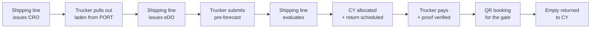
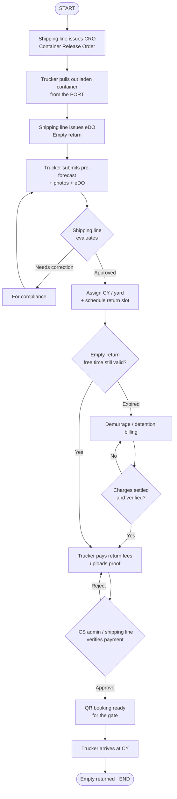

# ICS — Intelligent Container Solutions  
## Audio Visual Presentation (AVP) Script · Frame by Frame

**Product:** Intelligent Container Solutions (ICS)  
**By:** Trans-Net Software Development Services (TNSDS)  
**Format:** Canva frame-by-frame + AI voice-over  
**Tone:** Marketing · High-level · Clear · Confident  
**Suggested length:** ~2:30 – 3:00 minutes  
**Suggested aspect:** 16:9 (1920×1080)

---

### How to use this document

| Column | Use in Canva / VO |
|--------|-------------------|
| **On-screen** | Big headline + short line only — keep it scannable |
| **Visual** | What to put on the frame (photo, UI mock, icons) |
| **Voice-over** | Paste into AI VO (ElevenLabs, CapCut, etc.) |
| **Duration** | Target seconds per frame |

**Style tips for Canva**
- One idea per frame. No dense paragraphs.
- Brand: ICS logo + clean navy / teal logistics look.
- Prefer real container / port / truck imagery + simple UI screenshots.
- End each section frame with breathing room before the next VO line.
- **Intro:** slower, cinematic. **Outro:** calm, confident, hold on logo.

**Optional VO language:** English (default below). For Filipino VO, keep the same meaning — short sentences, no jargon.

---

# End-to-end flowchart

High-level ICS journey — from laden pull-out at the **port** to **empty return** at the CY.

**CRO** = Container Release Order → pull out the **laden** container from the **port**  
**eDO** = empty return → return the **empty** container

---

## Happy path (one glance)



**On-screen one-liner:** CRO (port) → eDO → Pre-forecast → Evaluate → Schedule → Pay → QR → Empty return

---

## Full end-to-end (with branches)

Use this for Canva / AVP if you want one complete process slide.

**PDF export:** [`ICS-End-To-End-Flowchart.pdf`](ICS-End-To-End-Flowchart.pdf) · Source: [`ICS-End-To-End-Flowchart.html`](ICS-End-To-End-Flowchart.html)  
**Re-export (single A4 portrait page):**
```powershell
cd docs
node export-flowchart-pdf.cjs
```
Uses Microsoft Edge if Puppeteer Chrome is not installed. Optional: `npx puppeteer browsers install chrome`



---

## Roles along the flow

| Step | Who | What happens |
|------|-----|----------------|
| 1. CRO | Shipping line | Authorize **laden pull-out** from the **port** |
| 2. Port pull-out | Trucker | Haul the laden container out |
| 3. eDO | Shipping line | Authorize **empty return** |
| 4. Pre-forecast | Trucker | Submit container details, photos, eDO |
| 5. Evaluate | Shipping line | Approve or send back for compliance |
| 6. Allocate & schedule | Shipping line / Depot | Right CY, right slot |
| 7. Pay & verify | Trucker → Admin / Shipping line | Proof of payment, then approve |
| 8. If free time expired | Shipping line + Trucker | Demurrage / detention first, then continue |
| 9. QR & gate | Trucker + Depot | Booking QR → empty in at CY |

---

## Canva layout (single flowchart slide)

**Title:** ICS end-to-end  
**Subline:** From port pull-out to empty return  

Left → right boxes (8):

1. **CRO** — Laden out of port  
2. **eDO** — Empty return  
3. **Pre-forecast**  
4. **Evaluate**  
5. **Schedule**  
6. **Pay**  
7. **QR**  
8. **Empty in CY**  

Optional small branch under Pay: **Free time expired → Settle demurrage → Continue**

---

# INTRO

> Use soft music bed. Keep VO warm and measured — set the scene before features.

---

## FRAME 01 — Cold open

| | |
|--|--|
| **Duration** | 4–5 sec |
| **On-screen** | *(none — or tiny “ICS” watermark only)* |
| **Visual** | Cinematic port / laden container / truck motion. Slow push-in. No busy text. |
| **Voice-over** | *(silence or soft ambient only — optional one breath line:)* In every port, every yard, every haul — timing matters. |

---

## FRAME 02 — Title card

| | |
|--|--|
| **Duration** | 5–6 sec |
| **On-screen** | **ICS** |
| **Subline** | Intelligent Container Solutions |
| **Visual** | Clean branded slate. ICS logo center. Fade-in title. Subtle light sweep. |
| **Voice-over** | Intelligent Container Solutions. |

---

## FRAME 03 — Presented by

| | |
|--|--|
| **Duration** | 5–6 sec |
| **On-screen** | A product of **TNSDS** |
| **Subline** | Trans-Net Software Development Services |
| **Visual** | TNSDS name/logo under ICS mark. Professional, minimal. |
| **Voice-over** | A product of Trans-Net Software Development Services. |

---

## FRAME 04 — Welcome hook

| | |
|--|--|
| **Duration** | 7–8 sec |
| **On-screen** | From **port pull-out** to **empty return** |
| **Subline** | One platform. Clearer operations. |
| **Visual** | Split motif: laden leaving port · empty returning to CY. ICS connects both. |
| **Voice-over** | Welcome. This is how ICS helps teams move containers with clarity — from laden pull-out at the port, to empty return done right. |

---

# MAIN PRESENTATION

---

## FRAME 05 — The big idea

| | |
|--|--|
| **Duration** | 7–9 sec |
| **On-screen** | **One platform.** From port pull-out to empty return. |
| **Visual** | Two simple flows side by side: **Laden @ Port** → truck · **Empty → CY**. Connecting ICS logo in the center. |
| **Voice-over** | ICS brings truckers, shipping lines, and depot teams together on one digital platform — from pulling laden containers out of the port, to returning empties the right way. |

---

## FRAME 06 — The problem (relatable, light)

| | |
|--|--|
| **Duration** | 8–10 sec |
| **On-screen** | Less chasing. Less confusion. Less delay. |
| **Visual** | Split: left = “old way” (calls, papers, chats — muted/gray). Right = ICS screen glow (clean/blue). |
| **Voice-over** | Too many calls. Too many messages. Too many missed steps. ICS replaces the chaos with one clear path — from release to return. |

---

## FRAME 07 — Who it’s for

| | |
|--|--|
| **Duration** | 8 sec |
| **On-screen** | Built for the container chain |
| **Bullets (short)** | Truckers · Shipping lines · Container yards · Operations leaders |
| **Visual** | Four clean role cards with icons. No long text. |
| **Voice-over** | Whether you haul, evaluate, schedule, or oversee — ICS is built for every role from port release to empty return. |

---

## FRAME 08 — Feature: Pre-forecast

| | |
|--|--|
| **Duration** | 8–9 sec |
| **On-screen** | **Pre-forecast** with confidence |
| **Subline** | Submit · Attach · Track |
| **Visual** | Phone/laptop UI mock of a clean “New pre-forecast” screen + container photo thumbnails. |
| **Voice-over** | Truckers submit a pre-forecast with the right container details and photos — so every empty-return request starts complete and ready for review. |

---

## FRAME 09 — Feature: CRO — laden pull-out

| | |
|--|--|
| **Duration** | 8–9 sec |
| **On-screen** | **CRO** · Container Release Order |
| **Subline** | Pull out the **laden** container from the **port** |
| **Visual** | Port terminal / laden container on truck leaving the gate. Document badge labeled **CRO**. Simple arrow: Port → Outbound. |
| **Voice-over** | CRO — Container Release Order. This is how shipping lines authorize pulling the laden container out of the port. Clear. Digital. Ready for the haul. |

---

## FRAME 10 — Feature: eDO — empty return

| | |
|--|--|
| **Duration** | 8–9 sec |
| **On-screen** | **eDO** · Empty return |
| **Subline** | Return the **empty** — with free time visible |
| **Visual** | Empty container heading to CY / depot. Document badge labeled **eDO**. Soft free-time calendar cue. |
| **Voice-over** | eDO covers the empty return. Truckers attach and verify it in ICS — so empty return instructions and free time are clear before the journey continues. |

---

## FRAME 11 — Feature: Shipping-line evaluation

| | |
|--|--|
| **Duration** | 8 sec |
| **On-screen** | **Evaluate.** Approve. Request fixes. |
| **Visual** | Decision UI: Approve / For compliance — clean cards, not a full dashboard dump. |
| **Voice-over** | Shipping lines review each request with full context — approve when ready, or send clear instructions when something needs correction. |

---

## FRAME 12 — Feature: Yard & allocation

| | |
|--|--|
| **Duration** | 7–8 sec |
| **On-screen** | **Right yard.** Right capacity. |
| **Subline** | CY allocation · Inventory awareness |
| **Visual** | Aerial yard / stacked containers + simple capacity meter graphic. |
| **Voice-over** | Assign empty returns to the right container yard with visibility on capacity and inventory — so planning stays realistic. |

---

## FRAME 13 — Feature: Scheduling

| | |
|--|--|
| **Duration** | 7–8 sec |
| **On-screen** | **Scheduled returns** |
| **Subline** | Slots · Status · On time |
| **Visual** | Calendar / time-slot graphic + truck approaching gate. |
| **Voice-over** | Depot teams schedule return slots and keep everyone aligned — so empty arrivals are expected, not surprising. |

---

## FRAME 14 — Feature: Payments made clear

| | |
|--|--|
| **Duration** | 8 sec |
| **On-screen** | **Pay. Prove. Verify.** |
| **Visual** | Receipt upload + checkmark. Simple peso amount. Keep it premium, not cluttered. |
| **Voice-over** | Truckers upload payment proof. Teams verify with confidence. Fees and returns stay transparent for everyone. |

---

## FRAME 15 — Feature: Demurrage & detention

| | |
|--|--|
| **Duration** | 8 sec |
| **On-screen** | **Demurrage & detention** — handled |
| **Subline** | Alert · Bill · Settle · Continue |
| **Visual** | Clock / free-time expired icon → billing card → “Settled” badge. |
| **Voice-over** | When free time on the empty return expires, ICS creates clear demurrage and detention billing — so charges are settled before the process continues. |

---

## FRAME 16 — Feature: QR booking & gate readiness

| | |
|--|--|
| **Duration** | 8 sec |
| **On-screen** | **QR booking** ready for the gate |
| **Subline** | Mobile · Printable · Connected |
| **Visual** | Large QR on phone + trucker holding device at depot gate. |
| **Voice-over** | After approval and payment, truckers get booking QR codes — ready on mobile or print — for a smoother empty-return gate experience. |

---

## FRAME 17 — The journey (one glance)

| | |
|--|--|
| **Duration** | 10–12 sec |
| **On-screen** | CRO (port) → Pre-forecast → Evaluate → Schedule → Pay → Empty return |
| **Visual** | Horizontal journey: start with **laden @ port (CRO)**, then ICS empty-return steps ending at **CY**. Animate step highlights in Canva if possible. |
| **Voice-over** | From Container Release Order at the port, to pre-forecast, evaluation, scheduling, payment, and empty return — ICS keeps the journey visible, auditable, and easy to follow. |

---

## FRAME 18 — Benefits (why it matters)

| | |
|--|--|
| **Duration** | 9–10 sec |
| **On-screen** | Clarity. Speed. Control. |
| **Three columns** | Faster coordination · Fewer errors · Better oversight |
| **Visual** | Three benefit tiles. Minimal icons. High contrast. |
| **Voice-over** | Faster coordination. Fewer mistakes. Stronger oversight. ICS helps every stakeholder move with clarity — and finish with confidence. |

---

# OUTRO

> Slow the music. End confident — thank the viewer, credit TNSDS, hold logo.

---

## FRAME 19 — Key takeaway

| | |
|--|--|
| **Duration** | 7–8 sec |
| **On-screen** | **One platform. Port to empty return.** |
| **Subline** | Clearer. Faster. In control. |
| **Visual** | Recap icons in a soft arc (CRO · eDO · Pre-forecast · Pay · QR). Fade to brand color. |
| **Voice-over** | One platform — from laden pull-out at the port to empty return. Clearer. Faster. In control. |

---

## FRAME 20 — Thank you

| | |
|--|--|
| **Duration** | 5–6 sec |
| **On-screen** | **Thank you** |
| **Subline** | For watching this presentation |
| **Visual** | Clean centered thank-you on branded background. Soft fade. No clutter. |
| **Voice-over** | Thank you for watching. |

---

## FRAME 21 — Built by TNSDS

| | |
|--|--|
| **Duration** | 6–7 sec |
| **On-screen** | Built by **TNSDS** |
| **Subline** | Trans-Net Software Development Services |
| **Visual** | ICS + TNSDS logos side by side. Professional credit frame. |
| **Voice-over** | ICS is proudly developed by Trans-Net Software Development Services — delivering practical digital solutions for logistics operations. |

---

## FRAME 22 — Closing CTA

| | |
|--|--|
| **Duration** | 7–9 sec |
| **On-screen** | **From port to empty return — smarter with ICS.** |
| **Subline** | Intelligent Container Solutions · A TNSDS product |
| **Visual** | Hero logo + soft motion (port → empty CY). Optional website / contact line. |
| **Voice-over** | From laden pull-out at the port to empty return — smarter container operations start with ICS. Intelligent Container Solutions — a product of TNSDS. |

---

## FRAME 23 — End slate

| | |
|--|--|
| **Duration** | 4–5 sec |
| **On-screen** | **ICS** · TNSDS |
| **Subline** | *(optional contact / website placeholder)* |
| **Visual** | Final logo hold. Fade to brand navy or black. Music resolves. |
| **Voice-over** | *(silence — music outro only)* |

---

## Quick definitions (for the team — not on-screen as paragraphs)

| Term | Meaning (simple) |
|------|------------------|
| **CRO** | **Container Release Order** — authorize **pull-out of the laden container from the port** |
| **eDO** | **Empty return** document / order — for returning the **empty** container |

---

## Full voice-over script (continuous)

### Intro

> In every port, every yard, every haul — timing matters.  
>  
> Intelligent Container Solutions.  
>  
> A product of Trans-Net Software Development Services.  
>  
> Welcome. This is how ICS helps teams move containers with clarity — from laden pull-out at the port, to empty return done right.

### Main

> ICS brings truckers, shipping lines, and depot teams together on one digital platform — from pulling laden containers out of the port, to returning empties the right way.  
>  
> Too many calls. Too many messages. Too many missed steps. ICS replaces the chaos with one clear path — from release to return.  
>  
> Whether you haul, evaluate, schedule, or oversee — ICS is built for every role from port release to empty return.  
>  
> Truckers submit a pre-forecast with the right container details and photos — so every empty-return request starts complete and ready for review.  
>  
> CRO — Container Release Order. This is how shipping lines authorize pulling the laden container out of the port. Clear. Digital. Ready for the haul.  
>  
> eDO covers the empty return. Truckers attach and verify it in ICS — so empty return instructions and free time are clear before the journey continues.  
>  
> Shipping lines review each request with full context — approve when ready, or send clear instructions when something needs correction.  
>  
> Assign empty returns to the right container yard with visibility on capacity and inventory — so planning stays realistic.  
>  
> Depot teams schedule return slots and keep everyone aligned — so empty arrivals are expected, not surprising.  
>  
> Truckers upload payment proof. Teams verify with confidence. Fees and returns stay transparent for everyone.  
>  
> When free time on the empty return expires, ICS creates clear demurrage and detention billing — so charges are settled before the process continues.  
>  
> After approval and payment, truckers get booking QR codes — ready on mobile or print — for a smoother empty-return gate experience.  
>  
> From Container Release Order at the port, to pre-forecast, evaluation, scheduling, payment, and empty return — ICS keeps the journey visible, auditable, and easy to follow.  
>  
> Faster coordination. Fewer mistakes. Stronger oversight. ICS helps every stakeholder move with clarity — and finish with confidence.

### Outro

> One platform — from laden pull-out at the port to empty return. Clearer. Faster. In control.  
>  
> Thank you for watching.  
>  
> ICS is proudly developed by Trans-Net Software Development Services — delivering practical digital solutions for logistics operations.  
>  
> From laden pull-out at the port to empty return — smarter container operations start with ICS. Intelligent Container Solutions — a product of TNSDS.

---

## Canva page checklist (copy into Canva page titles)

**Intro**  
1. Cold open  
2. Title card — ICS  
3. Presented by TNSDS  
4. Welcome hook  

**Main**  
5. Big idea — Port to empty return  
6. Problem — Less chasing  
7. Audience — Container chain  
8. Pre-forecast  
9. CRO — laden pull-out from port  
10. eDO — empty return  
11. Evaluation  
12. Yard & allocation  
13. Scheduling  
14. Payments  
15. Demurrage & detention  
16. QR booking  
17. End-to-end journey  
18. Benefits  

**Outro**  
19. Key takeaway  
20. Thank you  
21. Built by TNSDS  
22. Closing CTA  
23. End slate  

---

## Optional Tagalog VO (short, marketing)

Use if the AVP audience prefers Filipino. Keep English on-screen; VO can be Tagalog.

| Frame | Tagalog VO (short) |
|------|---------------------|
| 01 | *(optional)* Sa bawat port, bawat yard, bawat biyahe — mahalaga ang oras. |
| 02 | Intelligent Container Solutions. |
| 03 | Produkto ng Trans-Net Software Development Services. |
| 04 | Maligayang pagdating. Ganito tinutulungan ng ICS ang teams — mula port pull-out hanggang empty return. |
| 05 | Isang platform — mula sa pagkuha ng laden container sa port, hanggang sa empty return. |
| 06 | Mas kaunting tawag, chat, at abala. Isang malinaw na proseso mula release hanggang return. |
| 08 | Mag-submit ng pre-forecast na kumpleto — may detalye at larawan para sa empty return. |
| 09 | CRO o Container Release Order — pahintulot para kunin ang laden container mula sa port. |
| 10 | eDO para sa empty return — malinaw ang instruction at free time. |
| 14 | Mag-upload ng proof of payment. I-verify. Transparent para sa lahat. |
| 16 | May QR booking — handa sa mobile o print para sa gate. |
| 19 | Isang platform — mula port hanggang empty return. Mas malinaw. Mas mabilis. Mas kontrolado. |
| 20 | Salamat sa panonood. |
| 22 | Mula port pull-out hanggang empty return — mas matalino sa ICS. Produkto ng TNSDS. |
| 23 | *(tahimik — music outro)* |

---

## Brand notes for designers

| Item | Guidance |
|------|----------|
| Product name | **Intelligent Container Solutions (ICS)** |
| Company | **Trans-Net Software Development Services (TNSDS)** |
| Promise | One platform — **laden pull-out (CRO)** at the port, and **empty return (eDO)** to CY / terminal |
| **CRO** | Container Release Order = **pull out laden container from the port** |
| **eDO** | Empty return = **return the empty container** |
| **Intro** | Cinematic · title · TNSDS credit · welcome hook |
| **Outro** | Takeaway · thank you · TNSDS · CTA · end slate hold |
| Avoid on slides | Mixing CRO and eDO as the same thing · Technical stack · Long feature lists |
| Prefer | Outcomes: clarity, speed, coordination, control |

---

*Document for AVP production · High-level marketing · Not a technical manual.*
