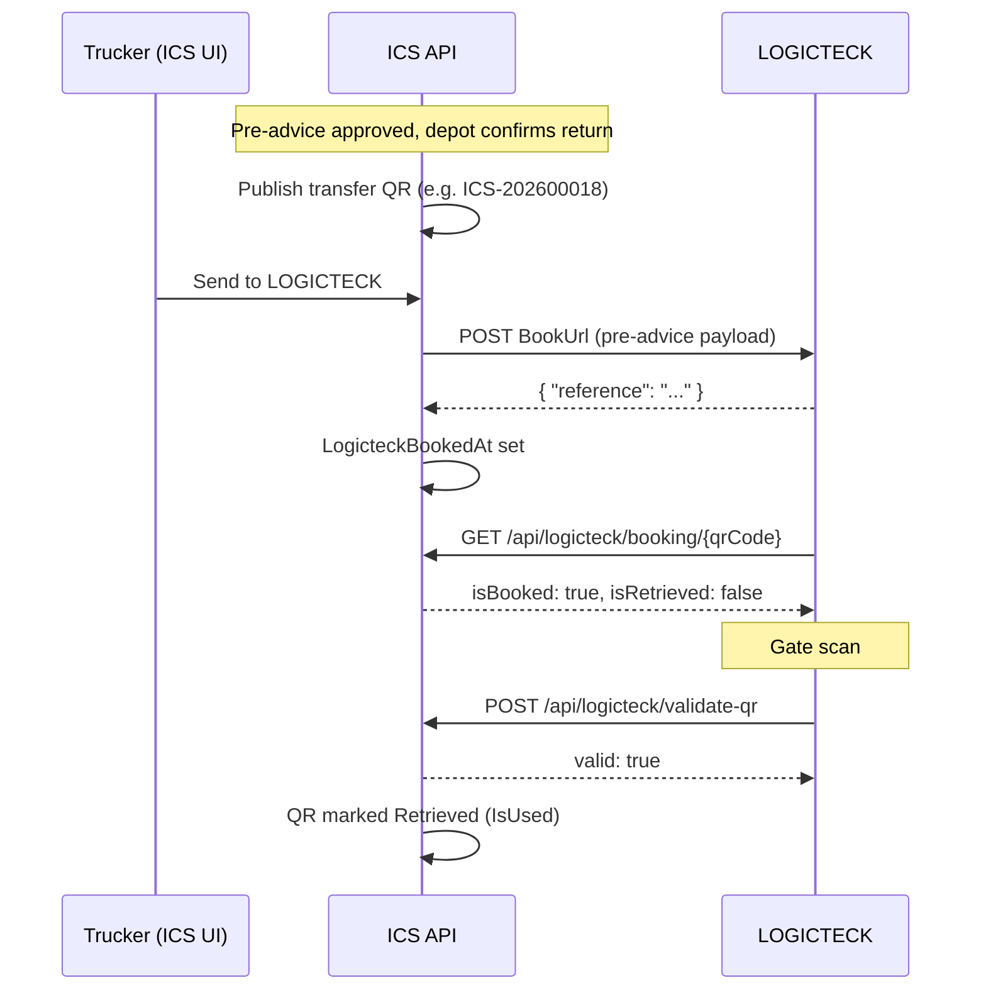

# LOGICTECK integration — setup guide

How ICS (ECMS) connects to **LOGICTECK** for empty container return bookings.

| System | Role |
|--------|------|
| **ICS** | Pre-advice workflow, transfer QR, **data transfer only** |
| **LOGICTECK** | Empty return **booking** (created and held on their side) |

ICS pre-advice status stays **Approved** after transfer. It does **not** become “Booked” in ICS — `isBooked` on the public API means **data was sent to LOGICTECK**, not an ICS workflow state.

---

## End-to-end flow



---

## Configuration

### Backend (`appsettings.json` / production)

Section: `Logicteck` in `backend/ECMS.API/appsettings.json` or `appsettings.Production.example.json`.

| Key | Required | Description |
|-----|----------|-------------|
| `ApiKey` | Recommended in production | Shared secret. When set, LOGICTECK must send header `X-Logicteck-Api-Key` on public ICS endpoints. ICS also sends this header on outbound POSTs to LOGICTECK. |
| `PublicApiBaseUrl` | Yes | Public ICS API base URL embedded in new QR payloads (e.g. `https://api.your-domain.com`). Used for validate URL in QR. |
| `BookUrl` | For live transfer | LOGICTECK endpoint that **receives** pre-advice data when trucker clicks **Send to LOGICTECK**. If empty, ICS records transfer locally without HTTP call (dev mode). |
| `PortalUrl` | Optional | URL opened in ICS UI after successful send (LOGICTECK portal). |
| `EmptyReturnUrl` | Optional | LOGICTECK endpoint for full empty-return form + photos. Falls back to `BookUrl` if empty. |

**Local development defaults** (`appsettings.json`):

```json
"Logicteck": {
  "ApiKey": "",
  "PublicApiBaseUrl": "http://localhost:5275",
  "BookUrl": "",
  "PortalUrl": "",
  "EmptyReturnUrl": ""
}
```

**Production example** (`appsettings.Production.example.json`):

```json
"Logicteck": {
  "ApiKey": "CHANGE-ME-logicteck-shared-secret",
  "PublicApiBaseUrl": "https://your-api.example.com",
  "BookUrl": "https://logicteck.example.com/api/receive-preadvice",
  "PortalUrl": "https://logicteck.example.com/portal",
  "EmptyReturnUrl": "https://logicteck.example.com/api/empty-return"
}
```

### Environment variable overrides

ASP.NET Core binds nested config with `__`:

| Variable | Maps to |
|----------|---------|
| `Logicteck__ApiKey` | `Logicteck:ApiKey` |
| `Logicteck__PublicApiBaseUrl` | `Logicteck:PublicApiBaseUrl` |
| `Logicteck__BookUrl` | `Logicteck:BookUrl` |
| `Logicteck__PortalUrl` | `Logicteck:PortalUrl` |
| `Logicteck__EmptyReturnUrl` | `Logicteck:EmptyReturnUrl` |

Set these in Railway, Hostinger VPS, or `backend/ECMS.API/.env.production` (see `.env.production.example` for other keys).

### Frontend (optional)

| Variable | Purpose |
|----------|---------|
| `VITE_LOGICTECK_PUBLIC_API_URL` | Default public API base on `/logicteck/api-test` (defaults to `http://localhost:5275`) |

---

## ICS pages (internal testing)

| Route | Purpose |
|-------|---------|
| `/logicteck/book?bookingId={id}` or `?qr=ICS-...` | LOGICTECK-style form; **Send to LOGICTECK** |
| `/logicteck/api-test?qr=ICS-...` | Test public lookup/validate + view full pre-advice dossier (dossier requires ICS login) |
| `/logicteck/empty-return` | Sample empty return form (photos, damage views) |
| `/preadvice/{id}?tab=overview` | Full pre-advice dossier with container photos |

---

## Public APIs (LOGICTECK → ICS)

Base URL: `{PublicApiBaseUrl}`  
Controller: `LogicteckController` in `backend/ECMS.API/Controllers/QrController.cs`

Optional auth (when `Logicteck:ApiKey` is set):

```http
X-Logicteck-Api-Key: your-shared-secret
```

### 1. Lookup booking (read-only)

Does **not** mark the QR as retrieved.

```http
GET /api/logicteck/booking/{qrCode}
```

**Example:** `GET http://localhost:5275/api/logicteck/booking/ICS-202600018`

**200 OK — found:**

```json
{
  "found": true,
  "message": null,
  "bookingReference": "ICS-202600018",
  "containerNo": "TEST66C4135",
  "shippingLine": "ASEAN SEAS LINE CO., LTD.",
  "trucker": "ABC Trucking",
  "preAdviceReference": "PA-2026-00058",
  "scheduledDate": "2026-06-27",
  "scheduledTime": "08:00",
  "depot": "ESAFE",
  "isBooked": true,
  "isRetrieved": false
}
```

**404 — not found:**

```json
{
  "found": false,
  "message": "Booking reference not found.",
  "isBooked": false,
  "isRetrieved": false
}
```

| Field | Meaning |
|-------|---------|
| `isBooked` | ICS has sent pre-advice data to LOGICTECK (`LogicteckBookedAt` set) |
| `isRetrieved` | LOGICTECK gate validated the QR (`IsUsed` — one-time) |

### 2. Validate QR (gate scan)

Marks QR as **Retrieved** on first successful call.

```http
POST /api/logicteck/validate-qr
Content-Type: application/json

{
  "qrCode": "ICS-202600018"
}
```

**200 OK — valid (first scan):**

```json
{
  "valid": true,
  "message": "Valid booking.",
  "bookingReference": "ICS-202600018",
  "containerNo": "TEST66C4135",
  "shippingLine": "...",
  "trucker": "...",
  "preAdviceReference": "PA-2026-00058",
  "scheduledDate": "2026-06-27",
  "scheduledTime": "08:00",
  "depot": "ESAFE"
}
```

**200 OK — already retrieved:**

```json
{
  "valid": false,
  "message": "QR already retrieved by LOGICTECK."
}
```

---

## Outbound transfer (ICS → LOGICTECK)

When a trucker clicks **Send to LOGICTECK** in ICS:

```http
POST /api/qr/{bookingId}/book-logicteck
Authorization: Bearer {ICS JWT}
```

ICS then POSTs to `Logicteck:BookUrl`:

```http
POST {BookUrl}
Content-Type: application/json
X-Logicteck-Api-Key: {ApiKey}

{
  "bookingReference": "ICS-202600018",
  "containerNo": "TEST66C4135",
  "shippingLine": "ASEAN SEAS LINE CO., LTD.",
  "trucker": "ABC Trucking",
  "preAdviceReference": "PA-2026-00058",
  "scheduledDate": "2026-06-27",
  "scheduledTime": "08:00",
  "depot": "ESAFE"
}
```

**Expected LOGICTECK response (2xx):**

```json
{
  "reference": "LOGICTECK-REF-123"
}
```

ICS stores `reference` as `LogicteckExternalRef` and sets `LogicteckBookedAt`.

If `BookUrl` is empty, ICS skips the HTTP call and still marks data as sent (useful for local dev).

Implementation: `LogicteckOutboundClient` in `backend/ECMS.Infrastructure/Services/LogicteckOutboundClient.cs`.

---

## Empty return form (optional, with photos)

Authenticated ICS endpoint:

```http
POST /api/logicteck/empty-return/submit
Authorization: Bearer {ICS JWT}
Content-Type: multipart/form-data
```

Forwards a richer payload (driver, plate, damage views, base64 photos) to `EmptyReturnUrl` (or `BookUrl`). See `LogicteckEmptyReturnTransmissionPayload` in `backend/ECMS.Application/DTOs/Logicteck/LogicteckEmptyReturnDtos.cs`.

UI sample: `/logicteck/empty-return`.

---

## QR code content

When ICS generates a transfer QR after depot confirmation, the payload includes:

- ICS QR reference (`bookingReference`, e.g. `ICS-202600018`)
- Container, shipping line, depot, schedule, trucker
- `validateUrl`: `{PublicApiBaseUrl}/api/logicteck/validate-qr`

LOGICTECK can scan the QR or use the reference string with the lookup/validate APIs.

---

## Status labels (ICS UI vs public API)

| ICS UI label | Backend `logicteckStatus` | Public API |
|--------------|---------------------------|------------|
| Ready to send | `Available` | `isBooked: false`, `isRetrieved: false` |
| Booked on LOGICTECK | `Booked` | `isBooked: true`, `isRetrieved: false` |
| Retrieved | `Retrieved` | `isRetrieved: true` |

Pre-advice workflow status in ICS remains **Approved** — it does not change to “Booked” when LOGICTECK receives data.

---

## Local setup checklist

1. **Start API:** `cd backend/ECMS.API && dotnet run --urls "http://localhost:5275"`
2. **Start frontend:** `cd frontend && npm run dev` → `http://localhost:5173`
3. Complete flow in ICS: pre-advice → approval → depot schedule → return confirmed → transfer QR published
4. **Send to LOGICTECK:** `/logicteck/book?qr=ICS-...` or from trucker return / pre-advice QR tab
5. **Verify externally:** `/logicteck/api-test?qr=ICS-...` or curl:

```bash
curl -s "http://localhost:5275/api/logicteck/booking/ICS-202600018"
```

```bash
curl -s -X POST "http://localhost:5275/api/logicteck/validate-qr" \
  -H "Content-Type: application/json" \
  -d "{\"qrCode\":\"ICS-202600018\"}"
```

With API key enabled:

```bash
curl -s "https://your-api.example.com/api/logicteck/booking/ICS-202600018" \
  -H "X-Logicteck-Api-Key: your-shared-secret"
```

---

## Production go-live checklist

### ICS team

- [ ] Set `Logicteck__PublicApiBaseUrl` to production API URL (must match QR validate URLs)
- [ ] Generate and share `Logicteck__ApiKey` with LOGICTECK
- [ ] Confirm CORS includes production frontend origin
- [ ] Run database migrations (includes `LogicteckBookedAt`, `LogicteckExternalRef` on `QRBookings`)
- [ ] Test lookup + validate from outside ICS (Postman or `/logicteck/api-test`)

### LOGICTECK team

- [ ] Provide **inbound URL** (`BookUrl`) that accepts the pre-advice JSON payload
- [ ] Return `{ "reference": "..." }` on success
- [ ] Implement lookup: `GET {PublicApiBaseUrl}/api/logicteck/booking/{qrCode}`
- [ ] Implement gate scan: `POST {PublicApiBaseUrl}/api/logicteck/validate-qr`
- [ ] Send `X-Logicteck-Api-Key` if ICS has `ApiKey` configured
- [ ] (Optional) Provide `EmptyReturnUrl` if using full form + photos path

---

## What LOGICTECK receives today vs not

| Data | Public lookup/validate | Outbound BookUrl POST | Empty return POST |
|------|------------------------|----------------------|-------------------|
| Container no, line, trucker | Yes | Yes | Yes |
| Pre-advice ref, schedule, depot | Yes | Yes | Yes |
| `isBooked` / `isRetrieved` | Yes | N/A | N/A |
| Container identity photos | **No** | **No** | Yes (base64) |
| Full pre-advice dossier | **No** | **No** | Partial |

Photos visible in ICS (`/preadvice/{id}?tab=overview`) are for internal verification unless sent via the empty-return integration.

---

## Audit events

| Action | Audit code |
|--------|------------|
| Send to LOGICTECK | `LOGICTECK_BOOK` |
| Gate validate QR | `LOGICTECK_VALIDATE_QR` |

---

## Related docs

- **LOGICTECK team handoff (QR / reference + credentials):** [LOGICTECK-API-HANDOFF.md](./LOGICTECK-API-HANDOFF.md)
- Railway deploy: [RAILWAY-DEPLOY.md](./RAILWAY-DEPLOY.md)

## Related files

| Area | Path |
|------|------|
| Public API controller | `backend/ECMS.API/Controllers/QrController.cs` |
| QR / transfer logic | `backend/ECMS.Infrastructure/Services/QrCodeService.cs` |
| Outbound HTTP client | `backend/ECMS.Infrastructure/Services/LogicteckOutboundClient.cs` |
| Config model | `backend/ECMS.Application/Configuration/LogicteckOptions.cs` |
| API key filter | `backend/ECMS.API/Filters/LogicteckApiKeyFilter.cs` |
| Integration tests | `backend/ECMS.API.Tests/LogicteckIntegrationTests.cs` |
| Frontend labels | `frontend/src/config/logicteckQr.ts` |

---

## Handoff summary for LOGICTECK

Give their integration team:

1. **ICS public API base URL** (`PublicApiBaseUrl`)
2. **Shared API key** (`X-Logicteck-Api-Key`)
3. **Their receive endpoint URL** (you configure as `BookUrl`)
4. This document (or the two public endpoints + outbound payload above)
5. A **test QR reference** (e.g. `ICS-202600018`) after one successful ICS flow

**Remember:** the return booking is created and owned by **LOGICTECK**. ICS only transfers approved pre-advice data and tracks send/retrieve status on the transfer QR.
