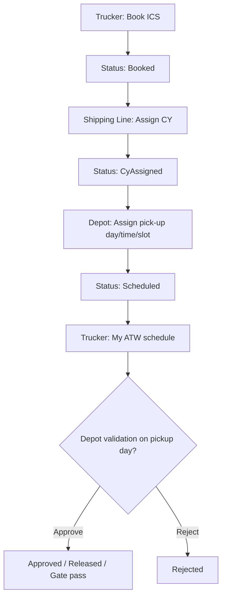

# ATW Booking Flow Plan (Export & Repositioning — Web Only)

## Goal

Implement the **book-first** ATW flow without Logicteck:

```text
ICS Trucker  →  BOOK ICS
Shipping Line  →  ASSIGN CY
Depot  →  ASSIGN PICK UP DAY
ICS Trucker  →  see pickup schedule
```

Optional tail (kept): depot approve / release / gate pass on pickup day.

## Decisions (defaults for v1)

| Topic | Decision |
|-------|----------|
| Export vs repositioning | Both purposes; same flow, `WithdrawalPurpose.Export` added |
| Booking # | External reference (free text), distinct from `ReferenceNo` (WR-…) |
| ATW document | Required before shipping line assigns CY; uploaded in book wizard |
| Legacy “Issue ATW first” | Kept in parallel on evaluator pages |
| After schedule | Approve / release / gate pass still available |
| Multi-container | One pickup schedule per withdrawal (all containers same slot) |

## Target lifecycle



## Data model

### `WithdrawalRequest` extensions

- `BookingNumber`, `TruckingCompany`, `PlateNumber`, `DriverName`
- `RequestedDepotId` (optional trucker preference)
- `AssignedDepotId`, `CyAssignedAt`, `CyAssignedByUserId`
- `BookedAt`

At book: `CurrentDepotId` uses first contracted depot as placeholder until CY is assigned.

### `WithdrawalSchedule` (new table)

Mirrors return `Schedule`: `WithdrawalRequestId`, `DepotId`, `Date`, `Time`, `SlotNo`, `Status`, `DepotRemarks`, `TruckerId`.

### Status enum additions

- `Booked` — awaiting CY assignment
- `CyAssigned` — awaiting depot pickup schedule
- `Scheduled` — pickup day assigned

## API

| Method | Endpoint | Role |
|--------|----------|------|
| POST | `/withdrawals/book` | Trucker |
| POST | `/withdrawals/{id}/assign-cy` | Evaluator |
| POST | `/withdrawals/{id}/schedule` | Depot |
| PUT | `/withdrawals/schedules/{id}` | Depot |
| GET | `/withdrawals/schedules/mine` | Trucker |
| GET | `/withdrawals/awaiting-cy` | Evaluator |
| GET | `/withdrawals/awaiting-schedule` | Depot |

Existing endpoints (documents, gate pass, approve/reject/release) remain for legacy and post-schedule tail.

## Web UX

| Role | Route | Action |
|------|-------|--------|
| Trucker | `/trucker/withdrawals/new` | Book ICS wizard |
| Trucker | `/trucker/withdrawals` | List with Booked / CY / Scheduled filters |
| Trucker | `/trucker/withdrawals/schedule` | Pickup schedule list |
| Evaluator | `/evaluations/atw` | Awaiting CY queue + Assign CY |
| Depot | `/depot/withdrawals` | Awaiting schedule tab + schedule pickup |

## Build order

1. Backend: migration, entities, service methods, API
2. Trucker book wizard + list/detail
3. Evaluator assign CY
4. Depot schedule pickup
5. Trucker schedule view

## Out of scope

- Logicteck integration
- Android trucker app changes
